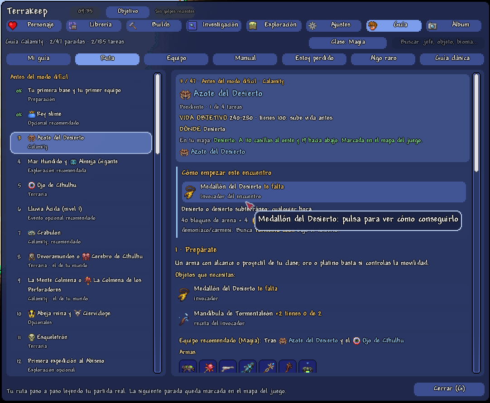
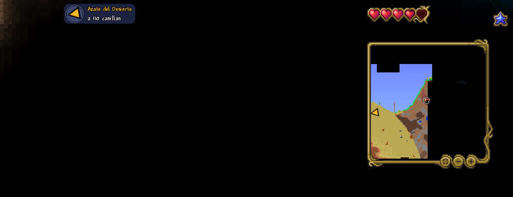
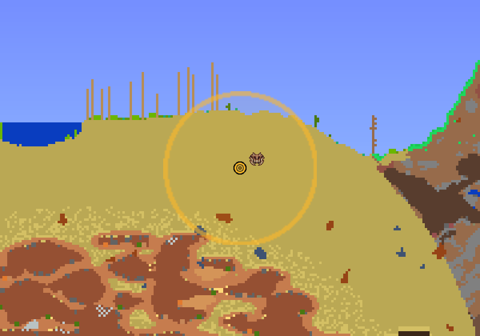
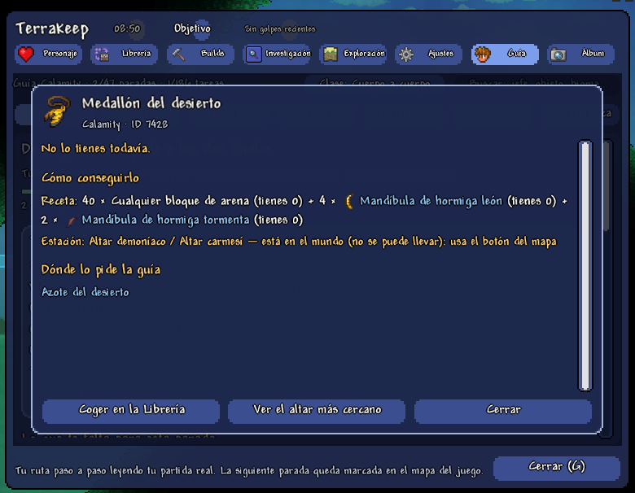
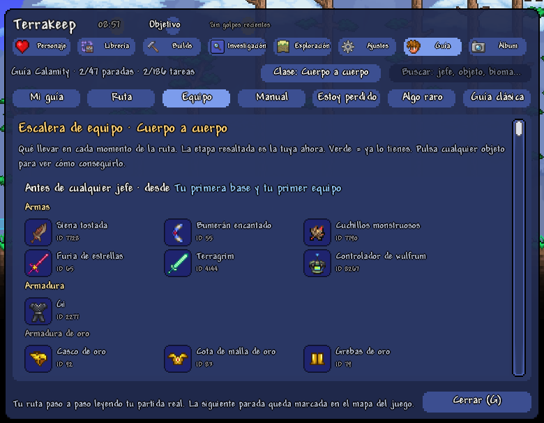
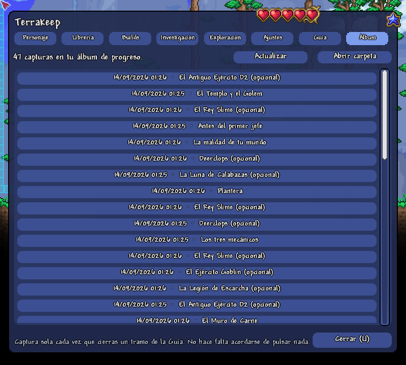
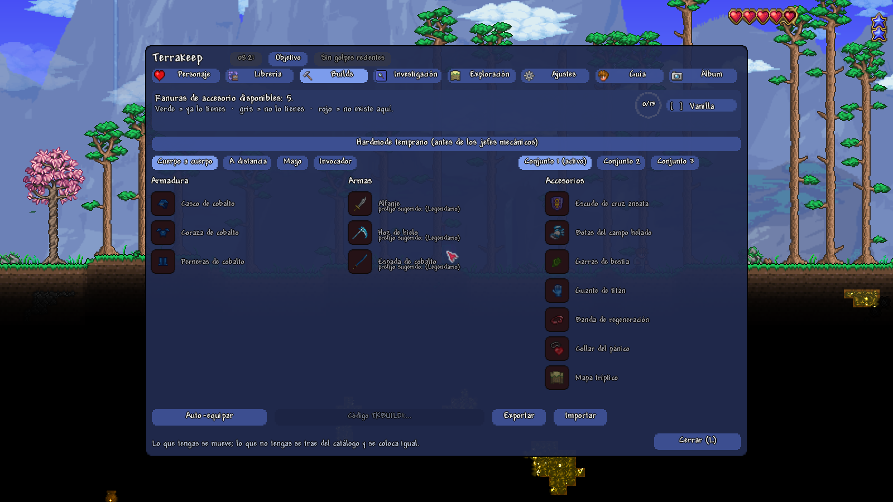
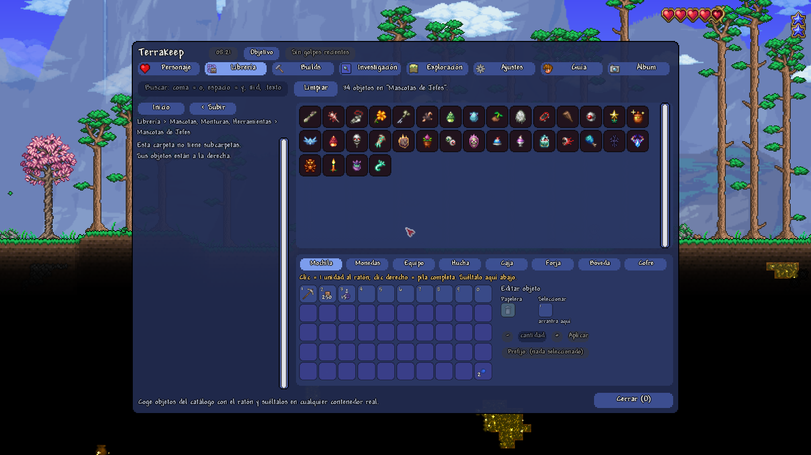
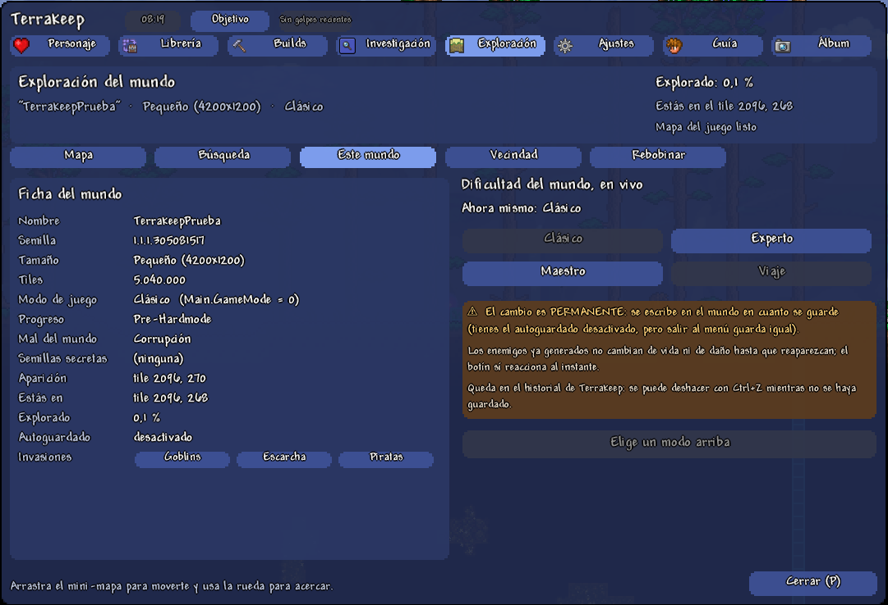
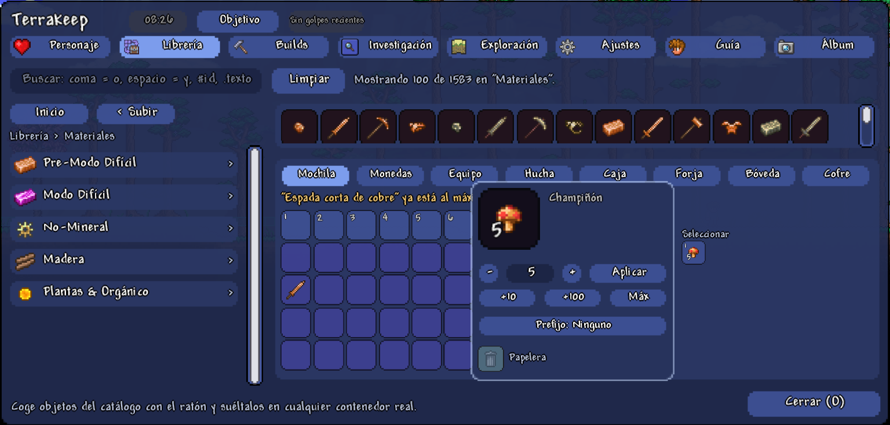

# Terrakeep (mod de tModLoader)

Del creador de [Terrakeep de escritorio](https://github.com/adriandelgadoalcalde-alt/Terrakeep)
(el editor offline de personajes y mundos de Terraria) - ahora la misma idea, pero **en vivo,
dentro de la partida**: un editor completo de personaje y mundo que corre como mod real de
tModLoader, sobre lo que ya tienes cargado. No abre ni toca ningún `.plr`/`.wld`: escribe
directamente sobre el personaje y el mundo de la sesión, y todo lo que hace se puede deshacer
con Ctrl+Z.

> Preparación técnica para publicarlo en el Steam Workshop de tModLoader: ver
> [`PUBLICAR-WORKSHOP.md`](PUBLICAR-WORKSHOP.md).

## Cómo se abre

Un único panel, tecla **K** (reasignable en Ajustes > Controles del propio juego) o el icono de
Terrakeep junto al bestiario y los emotes, con el inventario abierto.

## Capturas

   Ruta con Calamity: lista de paradas con su sprite a la izquierda y, a la derecha, la parada Azote del Desierto con vida objetivo, dónde cae en tu mapa, cómo empezar el encuentro y lo que te falta" />

  
  

  
   Equipo: escalera de cuerpo a cuerpo con el sprite, el nombre y el ID de cada objeto, agrupada en armas y armaduras" />

  
  

  
   Este mundo: ficha del mundo con la fila nueva de Invasiones (Goblins, Escarcha, Piratas) y, a la derecha, la dificultad en vivo con su aviso de permanencia" />

  

## Qué hace

Ocho pestañas, todas con la interfaz nativa de Terraria (sin ninguna ventana externa):

- **Personaje** - inventario, hucha/caja fuerte/forja/bóveda, los tres conjuntos de equipo (con
  editor de cantidad y papelera reales), buffs (con árbol de carpetas navegable), apariencia
  (peinado, variante, tintes, los siete colores y una **vista previa en vivo** del personaje,
  con o sin armadura puesta) y los 13 desbloqueos permanentes.
- **Librería** - catálogo navegable de TODOS los objetos de la partida, incluidos los de
  cualquier mod instalado (no solo Calamity), con buscador (`coma` = o, `espacio` = y, `#id`,
  `.texto` busca en el tooltip). Coge un objeto y suéltalo en cualquier contenedor real, o
  arrástralo al recuadro de edición para cambiarle la cantidad (con saltos rápidos de +10, +100
  o hasta el máximo real del objeto) o el prefijo, o para tirarlo a la papelera.
- **Builds** - equipo recomendado por etapa y clase, con "ya lo tienes" y auto-equipar a
  cualquiera de los tres conjuntos. Coloca primero lo que ya tienes; lo que te falte lo trae
  directamente del catálogo de la Librería (con su mejor prefijo real), sin tocar nunca nada
  que ya tuvieras puesto en otro sitio.
- **Investigación** - cuánto llevas investigado de cada carpeta en Modo Viaje, y cómo
  completarlo o quitarlo - pasa por la API oficial del juego, así que el menú de duplicar de
  Modo Viaje refleja exactamente lo mismo.
- **Exploración** - mini-mapa navegable con las texturas reales del juego, búsqueda de
  minerales, gemas, tesoros, cofres, NPCs, líquidos y paredes por todo el mundo, salto al mapa
  vanilla a pantalla completa con marcadores propios, cambio de dificultad en vivo con
  avisos claros de sus riesgos reales, las invasiones vencidas del mundo (Goblins, Legión de
  Escarcha, Piratas) editables y una pestaña Vecindad con la felicidad real de cada vecino, desde
  la que también puedes traer a un vecino que falte o echar a uno que ya viva aquí.
- **Ajustes** - idioma (Español/English) en vivo sin reiniciar, historial de deshacer/rehacer,
  y la lista real de atajos de teclado.
- **Guía** - la guía grande paso a paso, la misma que Terrakeep de escritorio 3.4.1 y con el
  mismo contenido: **vanilla** (49 paradas, 210 tareas) y, si tienes Calamity instalado,
  **Calamity** (47 paradas, 186 tareas), elegida sola según tu partida. Cada parada trae cómo
  empezar el encuentro, *Prepárate* (vida objetivo, objetos y equipo de tu clase), *Haz esto, en
  este orden* con sus casillas, qué hacer durante el combate o la exploración, lo que se
  desbloquea, *Listo para seguir cuando…* y lo que no conviene vender. Además: **Mi guía**
  (siguiente parada y progreso), **Equipo** (escalera por etapas para cuerpo a cuerpo, a
  distancia, magia, invocación y, en Calamity, pícaro), **Manual**, **Estoy perdido**, **He
  encontrado algo raro** y buscador. Las tareas se comprueban solas contra tu personaje y tu mundo
  en vivo (objetos, jefes y eventos, NPC, mejoras permanentes, modo de juego); las que no se
  pueden comprobar son casillas que marcas tú y viajan con el personaje.
  - **Marca permanente en el mapa** (pantalla completa, superpuesto y minimapa) en el lugar real
    de la siguiente parada en tu mundo - jefe, bioma, estructura o laboratorio -, con flecha en el
    borde si cae fuera de lo visible y zona marcada como aproximada cuando no hay una posición
    exacta. Se mueve sola al avanzar.
  - **Indicador en la pantalla de juego**, sin abrir ningún menú: una flecha que gira hacia la
    siguiente parada, la distancia en casillas y a qué apunta, con un aviso breve al llegar o al
    cambiar de destino. Clic para abrir la parada. Se coloca sin tapar la vida, el maná, el
    minimapa, el inventario ni los iconos de Calamity, y se configura en Ajustes (mostrar,
    posición y tamaño).
  - **Ficha "cómo conseguirlo"** de cada objeto que te falta: receta con sus ingredientes (también
    clicables, con cuántos tienes), estación y si la tienes cerca, botín, bolsa de jefe y tienda.
    Desde ahí, **Coger en la Librería** abre la Librería con ese objeto ya buscado.
  - La guía de antes (entrenador de jefe y guía de grupo) sigue en la sub-pestaña **Guía clásica**.
- **Álbum** - el diario visual de tu progreso: en cuanto cierras de verdad un tramo de la Guía
  (obligatorio u opcional) jugando, se dispara sola una captura real de pantalla que queda listada
  aquí con su nombre y su fecha, sin que tengas que acordarte de pulsar nada. Pulsa una entrada
  para abrir la captura a tamaño real con el visor de imágenes de tu sistema.

Es una herramienta puramente local: no añade contenido al juego, no hace falta sincronizarla en
multijugador y no cambia nada de la partida por su cuenta.

## Instalación

Este repo es el **código fuente** del mod (`ModSources`, no un `.tmod` compilado). Para
compilarlo tú mismo:

1. Copia esta carpeta a `Documents\My Games\Terraria\tModLoader\ModSources\TerrakeepMod\`.
2. Desde dentro del propio tModLoader: menú **Herramientas para desarrolladores de mods →
   Compilar y recargar** (o `scripts\compilar.ps1`, que documenta por qué compilar en dos fases
   hace falta en Windows).
3. Actívalo desde el menú **Mods** del juego.

Requiere tModLoader (probado en 2026.7.3.0). Compatible con o sin Calamity Mod instalado - la
Librería y Builds detectan solos qué mods hay cargados.

## Arquitectura

Reutiliza [`Terrakeep.Core`](https://github.com/adriandelgadoalcalde-alt/Terrakeep) (los
catálogos de datos del proyecto hermano de escritorio, ahora con doble destino `net10.0`/`net8.0`
para poder cargar dentro del runtime de tModLoader) como dependencia real vía `dllReferences` -
pero a diferencia de la app de escritorio, **nunca parsea ningún archivo**: todo se lee y se
escribe en vivo sobre los objetos reales del juego (`Main.LocalPlayer`, `Main.tile`,
`Main.chest`...).

Toda la interfaz está construida con los bloques nativos de Terraria (`IngameFancyUI`,
`UIPanel`, `UIList`, `ItemSlot` reutilizado tal cual de vanilla) - sin ninguna ventana ni
tecnología externa al juego.

## Novedades

### 0.8.1 (3-oct-2026)

Parche de pulido de la Guía: la ficha de cada objeto y la escalera de equipo ya no enseñan datos
técnicos.

- La **escalera de equipo** enseñaba bajo los objetos de Calamity su nombre interno
  (`CalamityMod/BurntSienna`). Ahora sale el **ID** numérico real de tu partida (`ID 7728`), igual
  que en vanilla, o nada.
- La **ficha de objeto** ya no enseña la línea de desarrollador «dato del código del juego:
  ….cs:56», ni el nombre en inglés ni el nombre interno del mod en la cabecera: queda `Calamity ·
  ID 7428`.
- Los **grupos de receta** se leen como una frase correcta: «40 × Cualquier bloque de arena»
  (antes «Cualquiera Bloque de arena»), «Cualquier madera», «Cualquier lingote de hierro»…
- Las **condiciones** de recetas, botín y tiendas salían como código (`DropHelper.PostDoG()`);
  ahora se traducen («tras derrotar al Devorador de dioses») y, si no tienen forma legible, no se
  enseñan.
- Las pruebas ahora **comprueban todo el texto visible** de la Guía y de las 2.176 fichas de
  objeto (también dentro del juego) para que no vuelva a colarse ningún resto técnico.
- Versión del mod: `0.8.0` → `0.8.1`. Comparte contenido con Terrakeep de escritorio 3.4.1.

### 0.8.0 (2-oct-2026)

- **Guía nueva, grande y paso a paso**, vanilla (49 paradas, 210 tareas) y Calamity (47 paradas,
  186 tareas), con el mismo contenido que Terrakeep de escritorio 3.4.0: estructura completa de
  cada parada, escalera de equipo por clase (incluido pícaro en Calamity) con el nombre y el ID junto a cada sprite, Manual, Estoy perdido,
  He encontrado algo raro y buscador, con nombres oficiales en español y comprobación automática
  en vivo contra tu personaje y tu mundo. Lo que no se puede comprobar se marca a mano y se guarda
  con el personaje.
- **Indicador en la pantalla de juego**: flecha hacia la siguiente parada, distancia y destino,
  siempre a la vista sin abrir el panel, con aviso al llegar y clic para abrir la parada.
  Configurable en Ajustes (mostrar, posición y tamaño). Probado a 1280x720, 1600x900, 1920x1080 y
  2560x1440 con la escala de interfaz normal y máxima, con el inventario cerrado y abierto, sin
  tapar la interfaz del juego ni el icono de dificultad de Calamity.
- **Marca permanente en el mapa** (pantalla completa, superpuesto y minimapa) en el lugar real de
  la siguiente parada en tu mundo, que se mueve sola al avanzar.
- **Ficha "cómo conseguirlo"** de cada objeto que falta (receta, estación, botín, bolsa, tienda) y
  atajo **Coger en la Librería** con el objeto ya buscado.
- La guía anterior queda como sub-pestaña **Guía clásica**; su brújula deja de pintarse en el mapa
  mientras la marca nueva está activa, para que el mapa no señale dos sitios a la vez.
- Arreglos: el panel se recoloca bien si cambias la resolución o la escala de interfaz con él
  abierto; la ayuda del pie ya no queda debajo de "Cerrar" en pantallas estrechas; la Mochila de
  la Librería cabe a 800x720; Ajustes > Atajos ya no se solapa con la caja nueva de la Guía; con la
  escala de interfaz máxima el texto de la Guía ya no pega unas palabras con otras.
- Los nombres de Calamity de la Guía salen de la traducción propia de la familia Keep
  (CalamityKeep-Traduccion-ES), sin ninguno en inglés. Lo que el juego pinta por su cuenta (por
  ejemplo, el buscador de la Librería) usa los nombres del Calamity instalado: con el mod de
  traducción de la familia activo, también en español.
- Versión del mod: `0.7.1` → `0.8.0`.

### 0.7.1 (29-sep-2026)

- **Un solo editor de objeto**: con un objeto en el recuadro de selección se veían a la vez la
  tarjeta flotante "Editar objeto" y el mini-panel fijo, los dos con cantidad, "Aplicar", prefijo
  y papelera. Ahora la tarjeta es el único editor (con el prefijo ya interactivo dentro) y el
  mini-panel se queda solo con el recuadro "Seleccionar", que es donde se arrastra el objeto de
  vuelta fuera para cerrarla.
- **La tarjeta ya no transparenta lo de debajo** (se veían los números de las ranuras detrás del
  nombre del objeto) y **tapa menos la mochila**: ocupa el hueco que deja libre el mini-panel.
- Versión del mod: `0.7.0` → `0.7.1`.

### 0.7.0 (29-sep-2026)

Paridad con Terrakeep de escritorio 3.3.0: se han revisado una a una sus 289 novedades desde el
20 de septiembre ([`docs/paridad-escritorio-3.3.0.md`](docs/paridad-escritorio-3.3.0.md)) y se
traen al juego las tres que tenían sentido dentro de la partida y faltaban:

- **Cantidad rápida en "Editar objeto"**: la tarjeta flotante de la Librería gana una fila
  **+10 / +100 / Máx** que nunca pasa del máximo real de apilado de ese objeto (de vanilla o de
  cualquier mod). Se deshace con Ctrl+Z, como el resto.
- **Invasiones vencidas, editables**: en Exploración > Este mundo, la ficha tiene una fila
  "Invasiones" con **Goblins**, **Escarcha** y **Piratas**. Resaltada = vencida; pulsa para
  cambiarla. Queda grabado en el mundo en el siguiente guardado y se deshace con Ctrl+Z.
- **Traer y echar vecinos**: en Exploración > Vecindad, **"Traer vecino..."** despliega los
  vecinos de la lista oficial que todavía no viven en tu mundo y trae al que elijas al punto de
  aparición, sin casa (el juego le busca una solo), y cada vecino tiene un botón **"Echar"** que
  lo retira sin matarlo. Las dos cosas se deshacen con Ctrl+Z.
- **"Zoom" siempre legible**: en Exploración > Mapa, el renglón de zoom ya nunca se dibuja por
  debajo del tamaño de letra más pequeño que usa el resto del mod, ni siquiera con la escala de
  interfaz al máximo. Si no hay sitio, antes de encoger letra se deja de enseñar el aviso del mapa
  grande (lo mismo lo dice la ayuda del botón "Ver en el mapa del juego").
- **"Este mundo" cabe entero en cualquier ventana**: la ficha aprieta el interlineado sin encoger
  la letra (y, en el caso más apretado, oculta los datos que ya repite la cabecera), y la columna
  de dificultad se desplaza con la rueda en vez de salirse por debajo y pisar "Cerrar".
- **El desplegable de prefijo vuelve a responder con un objeto seleccionado**: la tarjeta
  "Editar objeto" se quedaba los clics y la rueda encima del desplegable abierto.
- Todo lo que edita el mundo sigue siendo solo para partidas de un jugador.
- Versión del mod: `0.6.2` → `0.7.0`.

### 0.6.2 (29-sep-2026)

- **Prefijo sugerido de Builds, ya en español**: en la pestaña Builds, el pie de cada arma
  recomendada enseñaba el prefijo sugerido en inglés a pelo ("prefijo sugerido: Legendary"),
  incluso con el mod entero en español. Ahora sale con el nombre oficial que usa el propio
  Terraria en el idioma activo (`Lang.prefix`, la misma fuente que ya usaban el editor de
  prefijos de la Librería y el auto-equipar) - "prefijo sugerido: (Legendario)" en español,
  "suggested prefix: Legendary" en inglés.
- **Texto "Zoom" de Exploración, más legible en ventanas pequeñas**: en el caso más apretado
  (ventana pequeña con la interfaz del sistema ampliada), el renglón de zoom del minimapa podía
  quedar más pequeño de lo habitual para evitar solaparse con el aviso de arriba. Ahora el
  bloque de texto solo reserva sitio para "bajo el ratón" cuando de verdad tiene algo que
  enseñar (la mayoría de fotogramas no lo tiene), así que el resto de renglones - "Zoom"
  incluido - necesita comprimirse mucho menos.
- Versión del mod: `0.6.1` → `0.6.2`.

### 0.6.1 (29-sep-2026)

- **Tildes restauradas en la Guía**: el aviso "Tienes Calamity instalado" y casi todo el texto de
  los 25 tramos de Calamity salían sin tildes ("progresion", "arbol", "Lluvia Acida", "Modo
  Dificil"...). Corregidas 88 líneas del español, "¡Práctica superada!" en el informe del
  entrenador de jefe y la concordancia de "La Feromona Exótica"; en inglés, "Tramos with" pasa a
  "Stages with". Los jefes usan ya su nombre oficial en español, el mismo que muestra el juego:
  **Esqueletrón**, **Esqueletrón mayor** (antes "Esqueletron Prime") y **Gólem**. Una prueba
  automática vigila que no vuelvan a perderse.
- **El Álbum se ordena de verdad por fecha**, del hito más reciente al más antiguo. Antes solo se
  invertía el orden en que estaban guardados, así que un álbum copiado o fusionado salía mezclado,
  y una entrada con la fecha ilegible saltaba arriba del todo; ahora se va al final.
- Versión del mod: `0.6.0` → `0.6.1`.

### 0.6.0 (29-sep-2026)

- **Rediseño visual del panel** (TM1-TM6): pestañas con el sprite real del objeto/jefe en vez de
  solo texto, chips de cabecera con un tercer indicador de DPS en tiempo real, transición suave al
  cambiar de pestaña, alto dinámico del panel y checklist con icono real por requisito.
- **Diez funciones nuevas**: entrenador de jefe en la Guía (vida/defensa/daño de tu partida real,
  con el Muro de Carne excluido por un límite real del juego), sonar de estructuras (incluida la
  isla flotante de Calamity), diario automático de la partida (día/equipo/tiempo por cada hito),
  pestaña **Vecindad** en Exploración (felicidad real de los NPC de pueblo), los cofres del mundo
  como octavo destino navegable de la Librería, **rebobinado de terreno** (deshacer cambios de
  tiles y cofres con una foto real del estado anterior), marcadores de casas de NPC en el mapa,
  Laboratorio de Draedon (Calamity), aviso de "El grupo está listo" en partidas multijugador y
  códigos de build compartibles (`TKBUILD1:...`).
- **Builds** rediseñada: de cuatro filas de filtros a dos (alternador + desplegable + anillo de
  progreso), con el reparto de equipo por clase corregido para que ya no se solape.
- **Arreglos reales**: el anillo de progreso de Builds se salía de su marco; el texto de "Vecindad"
  se solapaba consigo mismo a UIScale alto; el desplegable de etapa de Builds recortaba texto;
  Rebobinar perdía la foto de referencia al cerrar el panel; el chip de DPS de la cabecera se salía
  de su pastilla con "Sin golpes recientes"; el editor de objeto flotante de Librería/Personaje
  tenía dos bugs reales (uno de ellos quedaba "atrapado" sin poder cerrarse); renombrar un conjunto
  desplazaba el texto al parpadear el cursor; la pestaña Vecindad reconstruía su lista y parpadeaba
  sin que hubiera ningún cambio real; el mini-mapa interno de Exploración ya dibuja los NPC de
  pueblo reales.
- **Auditoría de UIScale/resolución** completa (48 combinaciones de resolución × escala): 3 defectos
  reales de solape/desbordamiento, todos acotados a 1366×768 al 150%, cerrados con un reflujo
  vertical general que comprime posición y escala de texto a la vez (nunca solo una de las dos).
- **Paridad de terminología** con Terrakeep de escritorio (español e inglés) y sincronización de las
  etiquetas de la Librería.
- Preparación técnica para el Steam Workshop de tModLoader (sin publicar todavía: falta el paso
  manual de "Publish" desde dentro del juego) - ver [`PUBLICAR-WORKSHOP.md`](PUBLICAR-WORKSHOP.md).
- Versión del mod: `0.5.0` → `0.6.0`.

### 0.5.0 (16-sep-2026, madrugada)

- **Arreglado un bug real**: la Guía podía quedarse marcando un paso muy temprano como pendiente
  para siempre, aunque el jefe llevara mucho tiempo derrotado en el mundo real - un requisito que
  ningún editor de archivos estático puede comprobar de verdad (el daño real del arma) se trataba
  como bloqueante en vez de "sin datos todavía". El cerebro de evaluación de la Guía queda
  consolidado en un solo sitio compartido con Terrakeep de escritorio.
- **Auditoría de precisión completa** de los 46 tramos (116 pasos) contra el código real
  decompilado del juego y Calamity, no de memoria: entre otros, romper altares exige el Martillo
  Sagrado del Muro de Carne (no basta con matar al Devorador/Cerebro); Piratas y Legión de
  Escarcha son de Modo Difícil, no prehardmode; los TRES mecánicos hacen falta juntos para
  Plantera, no uno cualquiera; la Emperatriz de la Luz se enfurece de día, no de noche; el Golem
  tiene invulnerable el cuerpo mientras la cabeza siga montada, no al revés; oleadas reales de las
  Lunas y objetos de recompensa inventados sustituidos por los reales.
- Versión del mod: `0.4.0` → `0.5.0`.

### 0.4.0 (15-sep-2026)

- **Cobertura absoluta de la Guía**: 25 tramos nuevos de Calamity (60 pasos), sobre los 21 tramos
  vanilla que ya existían - la progresión del panel cubre ahora el juego entero, con o sin
  Calamity instalado. Arquitectura nueva y verificada contra el `.tmod` real de Calamity (banderas
  de jefe por reflexión, NPC/objetos de invocación resueltos por su nombre real en tiempo de
  carga), nunca supuesta.
- **Reescritura completa de tono** de todo el texto que lee el jugador en la Guía (español e
  inglés, vanilla incluido): fuera nombres de clase, código C# literal y variables internas que se
  habían colado en pantalla; dentro, la misma voz de aventura que usa la propia Terraria Wiki.
- Verificado en vivo con el cliente gráfico real y Calamity cargado
  (`scripts\verificar-guia.ps1 -Calamity`): compila sin errores, `AUTOPRUEBA GUIA COMPLETA`, 0
  comprobaciones en rojo.
- Versión del mod: `0.3.0` → `0.4.0`.

## Autoría y créditos

Terrakeep está diseñado y desarrollado por **IncrediBad**.

Terraria, tModLoader y Calamity Mod son propiedad de sus respectivos autores (Re-Logic, el
equipo de tModLoader y el equipo de CalamityMod). Terrakeep no está afiliado con ninguno de
ellos.

## Licencia

Ver [`LICENSE.md`](LICENSE.md).
